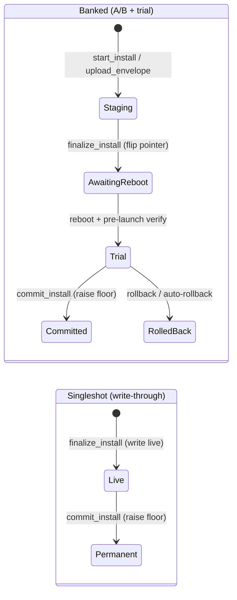
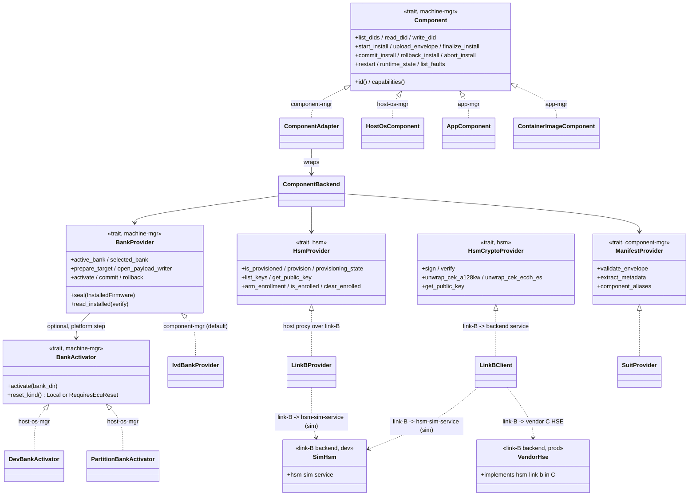
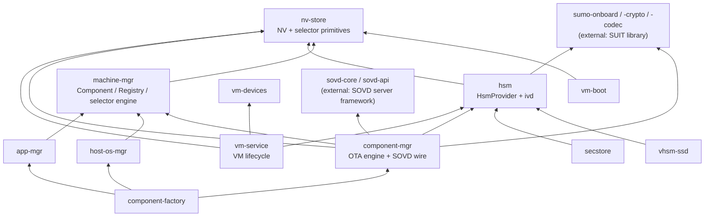
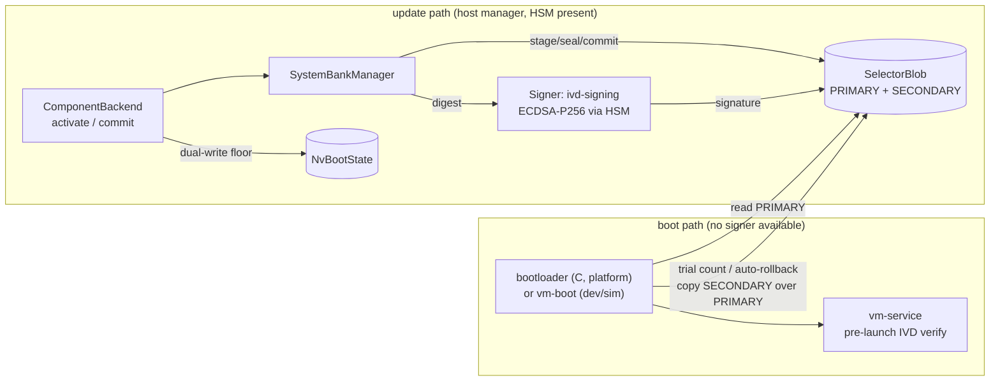
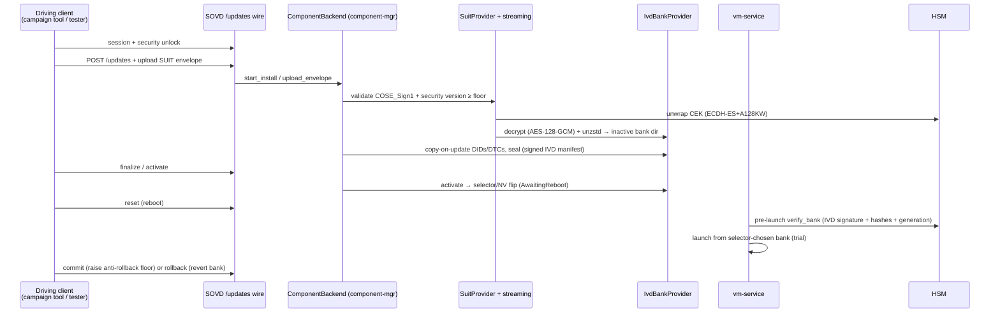

# Architecture: sumo-machine-manager

> Refreshed 2026-06-10. Earlier revisions documented a pre-rename architecture
> (`hypervisor-mgr`, `VmBackend`, `ComponentDiagBackend`, a 5-slot `BankSet`) that
> no longer exists. The code + each crate's `CLAUDE.md` are the canonical source
> for exact signatures; this doc is the contributor map.
>
> **Scope:** this document describes sumo-machine-manager as a freestanding
> project — its crates, seams, and the contracts it exposes to platform
> integrators. It does not describe any particular device integration or
> deployment; those live with the integrating system.

## Overview

Platform-agnostic machine manager for automotive ECUs. Manages A/B-bank software
updates across **multiple component kinds** (host-OS, RT core, VMs, container apps,
the HSM keystore) behind one update abstraction, with SUIT-manifest validation,
encrypted firmware, a signed node-level **boot selector**, and SOVD-compatible
diagnostics (UDS DIDs/DTCs + an OTA `/updates` wire).

Developed/tested on Linux (file-backed NV + QEMU); the `machine-mgr` trait layer +
per-crate `BlockDevice` / `HsmProvider` / `BankActivator` / `BankProvider` seams let
the same business logic run on other platforms (e.g. a QNX qvm hypervisor host) by
supplying concrete impls.

**Two-process model on a node:** `vm-service` (QEMU/qvm process lifecycle) +
`vm-sovd` (diagnostics + OTA engine). A platform integrator may also embed both in
a single host-manager binary that itself rides the **Os** bank set (i.e. the host
manager is one of the components it updates).

**Division of responsibility (important):** the **real bootloader is C, owned by
the platform** — it reads the HSM + the raw boot vectors and starts the RT side,
then the host OS. This codebase only (1) does the A/B software update of each bank,
(2) writes the boot vectors, and (3) HSM-signs that data. The Rust `vm-boot` crate
is a **dev/sim stand-in** for the bootloader, not the boot authority. The raw
on-medium boot-vector format + the C-side verify are pending the platform spec;
until then the selector is a human-inspectable JSON store, with a real HSM signature.

## The update abstraction (lead with this)

The conceptual base is **"a thing that can be updated"** — `machine_mgr::Component`
(`crates/machine-mgr/src/component.rs`, ~35 async methods, mostly `NotSupported`
defaults). Two structural shapes, discriminated at runtime via `Capabilities`:

| Shape | Lifecycle | Implementors |
|---|---|---|
| **Banked** — A/B + trial + commit/rollback | `start_install → upload_envelope → finalize_install (flip, reboot) → trial → commit_install OR auto-rollback` | `ComponentAdapter` (component-mgr, over `ComponentBackend`), `HostOsComponent` (host-os-mgr), `AppComponent` (app-mgr), an RT-core component |
| **Singleshot** — write-through, no rollback | `start_install → upload_envelope → finalize_install (write live) → commit_install (raise floor)` | the HSM keystore (a single-bank `ComponentBackend`), `ContainerImageComponent` (app-mgr) |



**Nearly everything is Banked/rollbackable** — even container images (bank the
manifest, keep both images in the registry). **The HSM keystore is the one genuinely
irreversible component** (secrets overwrite the old material; hardware security
engines have no rollback). The safety invariant that follows is a **transaction
property, not a per-component one**: *never mix rollbackable + irreversible
components in one upgrade* — a rollback of a mixed upgrade leaves the node undefined
(a VM reverts while the HSM keys are stuck forward). That guard belongs in the
offboard campaign/orchestration layer, not here. (A compile-time `Banked`/`Singleshot`
trait split was considered and **dropped** — it would type one outlier and not
enforce the real invariant.)

`MachineRegistry` (`crates/machine-mgr/src/machine.rs`) holds the components as
`Vec<Arc<dyn Component>>` + an id index and routes by `component_id`. Each component is
built by `component-factory::build_component` from a `ComponentSpec`.

### Seams (traits a platform integrator implements or swaps)



Integrators can add further impls outside this repo (e.g. a hardware-HSE
`HsmProvider`, a raw-partition RT `BankProvider`, platform device transports) —
the seams above are the supported extension points.

## Workspace crates

30 runtime crates (+ 2 tools crates under `tools/crates/`). The core update/diagnostics path:

- **nv-store** (lib): sector-rotated NV regions (boot state, factory, FW meta, runtime
  DIDs) with CRC-32 + monotonic `write_seq`, over a pluggable `BlockDevice`. Also owns
  `selector` — the signed, generation-counted **boot-selector** primitives
  (`SelectorBlob`, `SelectorStore`, `Signer`) that a low crate like `vm-boot` can read
  without depending up.
- **vm-boot** (`crates/boot`, bin+lib): boot-time decision logic for all bank sets.
  Reads the **selector** (PRIMARY/SECONDARY) when present, else NV boot state; counts
  trial boots; global (whole-blob) auto-rollback. Dev/sim stand-in for the C bootloader.
- **machine-mgr** (lib): the `Component` + `Machine`/`MachineRegistry` trait layer;
  `Capabilities`/`FlashCaps`; the `BankActivator` seam; `system_bank_state`
  (`SystemBankManager` + `BootSelector` — the node boot-authority engine, re-exporting
  the nv-store selector primitives). Platform-independent.
- **component-mgr** (lib + the `vm-diagserver` CLI bin; the SOVD/OTA **server** bin `vm-sovd` is
  its own crate): the OTA engine + SOVD wire. `ComponentBackend` (the
  per-component state machine — DIDs, faults, the full install/flash lifecycle, modes);
  `ComponentAdapter` (exposes it as a `Component`); `install_router_diag`
  (`InstallRouterDiag` — routes a VM's install methods to its container-vs-VM router,
  delegates everything else to the engine); `bank_provider` (the `BankProvider` seam:
  `IvdBankProvider`); `dispatcher` (SUIT-aware target `BankSet` resolver); `suit_provider`,
  `manifest_provider`, `streaming`, `did`, `ota`. **`ComponentBackend` is wired directly
  into SOVD** — the old `ComponentDiagBackend` round-trip adapter was deleted (converged
  to one backend).
- **host-os-mgr** (lib): `HostOsComponent` (Banked); `DevBankActivator` (mount+copy) and
  `PartitionBankActivator` (raw partition write) impl `machine_mgr::BankActivator`.
- **app-mgr** (lib): `AppComponent` (Banked) + `ContainerImageComponent` (Singleshot —
  imports detached `#container-image` payloads into Docker/Podman/containerd).
- **component-factory** (lib): `build_component(ComponentSpec, FactoryDeps)` — builds the
  right backend + adapter per component kind (incl. the install router for app-capable VMs).
- **vm-service** (lib + bin): QEMU/`qvm` lifecycle, per-bank VM config, the pre-launch
  IVD verify hook, IPC to vm-sovd. `runner/{qemu,qnx,dummy}`. Launches the VM **from the
  selector-chosen bank dir** (cwd=bank_dir) so the per-bank qvm.conf's relative
  `load kernel` resolves there (no `current` symlink).
- **vm-devices** (lib): host-side virtual CAN / health / time simulators (ivshmem vs QNX shm).
- **hsm** (lib): the HSM **contract** — `HsmProvider` (keystore/provisioning, 8 methods) +
  `HsmCryptoProvider` (re-exported from `hsm-contract`); `LinkBClient` + `serve_crypto` (the
  link-B bridge to an **out-of-process** backend — the sim `hsm-sim-service` in
  `tools/crates/hsm-sim-backend`, or a vendor C HSE implementing `hsm-link-b`, with the C
  vendor skeleton at `crates/hsm-link-b/reference/` and the conformance suite at
  `tools/crates/hsm-conformance`); `ivd` (per-bank IVD manifest sign/verify with the
  `ivd-signing` key — the same key that signs the boot selector). 11 mandatory `KeyRole`s.
  Contract-only — no in-process HSM lives here; see `docs/hsm-backend-architecture.md`.
- **vhsm-ssd** (lib + bin): host daemon terminating the guest `/dev/vhsm` v3 handle
  protocol over TCP on a private host bridge; identity = CWT/IAM handshake (source-IP pre-gate).
- **secstore** (lib): encrypted key-metadata persistence (`SecstoreEncryptor` +
  `SecstoreBackend`).

Support crates: **sumo-verify** (management-path SUIT/IVD verify), **policy-eval** /
**policy-partition** / **policy-build** (guest IAM policy), **ca-bundle-build**,
**vm-wire**, **host-metrics** (OpenTelemetry/Prometheus host sensors), **log-rotate**,
**puller**.

### Crate composition (bottom-up)



External dependencies of note: the **SOVD server framework** (`sovd-core`'s
`DiagnosticBackend` trait + `sovd-api`'s router — `ComponentBackend` implements the
trait and is served by that router) and the **SUIT manifest library**
(`sumo-onboard`/`sumo-crypto`/`sumo-codec` for envelope validation, streaming
decrypt, decompression).

## Boot authority — the selector

The node has one signed boot record, the **selector**, that supersedes the original
per-component NV boot state as the authority for "which bank each set boots from":

- `SelectorBlob { generation: u64, selectors: BTreeMap<BankSet, Bank>, sha256, signature }`
  (`nv-store::selector`). Two slots via `SelectorStore`: **PRIMARY** (booted) and
  **SECONDARY** (rollback floor). A set is in trial iff `PRIMARY[set] != SECONDARY[set]`.
- **Signed by the HSM** with `ivd-signing` (a `Signer` impl supplied by the host-manager
  process, where the HSM is reachable; verified at `SystemBankManager::load`).
  Previously a `StubSigner` (empty signature) — now real ECDSA-P256. The on-medium store
  is the file-backed JSON `FileSelectorStore` — a sim stand-in until the C/hardware
  boot-vector spec lands.
- `vm-boot` reads PRIMARY and drives the bank decision; trial/rollback is **global**
  (whole-blob copy of SECONDARY over PRIMARY — vm-boot has no signer at boot so it can't
  re-sign a per-set change).
- `BankSet` is a `pub struct BankSet(pub u8)` newtype: `Hsm=0, Bootloader=1, Os=2, Rt=3,
  Vm1=4, Vm2=5`, `NUM_BANK_SETS=10` (the first 6 are named; the rest reserved). The host
  manager rides the **Os** slot; RT is before the VMs.



The `BankProvider` seam (`component_mgr::bank_provider`) routes *every* bank touch (stage /
activate / commit / rollback / selected-bank) through one trait per kind, so the boot
selector + NV stay consistent. `IvdBankProvider` is the default (signed CBOR manifest in
the bank dir + NV boot-state); alternative providers (e.g. raw-partition RT) plug in at
the same seam.

## OTA update flow (SOVD `/updates` wire)

Production OTA is SUIT envelopes driven over the SOVD **`/updates`** wire (the older
`/files` + `/flash/transfer` endpoints are retired). Per component, the driving client
runs session → security unlock → upload envelope → finalize → activate → commit/rollback.



The engine steps (`ComponentBackend` + `ota.rs`):

1. **Upload + validate**: `suit_provider` checks the COSE_Sign1 signature against the
   provisioning authority, the security version against the per-bank anti-rollback floor
   (`min_security_ver`), and `streaming` decrypts (AES-128-GCM + ECDH-ES+A128KW per-device)
   + decompresses (zstd) payloads into the target (inactive) bank dir. Multi-payload:
   VMs carry `#kernel` + `#firmware` (rootfs) + `#config` + partitions; host-os carries
   `#ifs` + `#rootfs`; the HSM carries `["hsm","keys"]`.
2. **Copy-on-update**: runtime DIDs/DTCs are cloned active→target bank before write.
3. **Finalize**: dual-bank flips the boot pointer (via the selector / NV) and needs a
   reboot (`AwaitingReboot`); single-bank (HSM) writes live and is immediately `Activated`.
4. **Reboot + verify**: `vm-service`'s pre-launch hook runs `hsm::ivd::verify_bank` (HSM
   signature on `ivd-manifest.cbor` + per-file hashes + generation floor) on the
   selector-chosen bank before launching.
5. **Commit / rollback**: commit raises the security floor + marks permanent; rollback
   reverts to the previous bank (Banked only — the HSM rejects rollback).

`FlashState` (sovd-core) is the 13-state dual-bank machine; single-bank collapses to
`… → Activated → Committed`. The committed bank's signed identity is exposed as the
vendor data param **`x-sumo-installed-manifest`** (files+sha inventory + IVD identity +
signature for re-verification), and each component's update-mode as
**`x-sumo-update-mode`** (`{update_mode: banked|singleshot, supports_rollback, dual_bank,
reset_kind}`, readable even pre-flash). Both are served from component-mgr's `read_data` hook
over the SOVD server's generic vendor-parameter wire — **all `x-sumo-*` vendor surface
is owned by this codebase**, keeping the SOVD server layer itself vendor-free.

## VM launch (vm-service)

`vm-service` resolves the bank from the selector-set `bank` enum (never a `current`
symlink — that's retired), exposes the bank's `rootfs.img` + partitions as devb-loopback
device nodes (`/dev/qvmdisk-vmN0`, …), runs the IVD verify gate, then launches `qvm @<bank
dir>/qvm.conf` **with cwd = the bank dir** so the conf's relative `load kernel` resolves to
that bank. The qvm.conf is **host-integration config** (NICs, disks, MMIO) and lives with
the deployment, not the guest build (which ships only a reference example).

## State management

Per-component NV (sector-rotated, CRC-protected, power-loss-safe): `NvBootState`
(`[BankBootState; NUM_BANK_SETS]` — active_bank/committed/boot_count per set), `NvFactory`
(serial/VIN/HW ids, write-once), `NvFwMeta` (per set+bank: fw identity, security version,
image hash, `min_security_ver` floor), `NvRuntime` (writable per-bank DIDs/DTCs). Boot
authority sits *above* this in the signed selector. Live SOVD/upload state is in-memory
under a per-component mutex.

DID resolution priority: Runtime (writable, per-bank) > FW-meta / signed IVD manifest
(software identity F187–F19E) > Factory (hardware identity) > Dynamic (computed from boot
state + health). Identity DIDs are served from the *signed* manifest overlay and gate on a
committed manifest (list↔read agree).

## Key design patterns

- **Generic over `BlockDevice`** — `NvStore<D>`/`BootManager<D>` parameterized over storage
  (MemBlockDevice tests, FileBlockDevice dev, raw block prod).
- **Sector rotation** — each NV region rotates 2–8 sectors; write to lowest `write_seq`,
  read highest valid CRC. Wear-leveling + atomic + corruption recovery. `NvRecord` =
  magic + write_seq + manual LE payload + CRC.
- **One backend, not two** — `ComponentBackend` is the single data/OTA authority wired
  directly into SOVD. App-capable VMs keep a *narrow* `InstallRouterDiag` (routes only
  install/flash to the container-vs-VM router, delegates the rest to the engine). The old
  `ComponentDiagBackend` round-trip adapter is gone.
- **BankProvider seam** — every bank touch goes through one trait per kind; the selector
  is the authority, NV is the floor.
- **Boot selector is HSM-signed** — `ivd-signing` signs the selector digest in the
  host-manager process (HSM present); the (future C) bootloader verifies at boot (HSM
  present on real silicon).
- **qvm.conf is host-integration** — lives with the deployment; relative `load kernel`
  + vm-service cwd=bank_dir; no `current` symlink.
- **Anti-rollback floor** — `min_security_ver` raised only on commit (not install), so
  trial can roll back; once raised, lower security versions are permanently rejected.
- **Copy-on-update** — runtime DIDs/DTCs cloned to the target bank before OTA write.
- **Encrypted key metadata (secstore)** — separates "where bytes live" from "how they're
  encrypted"; `vhsm-ssd` is the single atomic writer; production swaps in a hardware-backed
  encryptor.
- **Independent bank sets** — sets have independent A/B state, enabling staged rollouts.
  But an upgrade must not mix rollbackable + irreversible (HSM) — see the update
  abstraction above.

## Build & test

```bash
cargo build
cargo test              # 425+ tests
cargo run -p component-mgr --example build_hsm_keys   # generate SUIT artifacts
./example/run.sh --fresh    # start the SOVD server
```

Unit tests use `MemBlockDevice` (zero I/O). SOVD integration tests drive the real router
via `tower::ServiceExt::oneshot()` (no live server) covering session/security/upload/
prepare/execute/commit + the install-router + the vendor data params. HSM/vhsm-ssd tests
cover sign/verify/encrypt/derive + handle/policy + SUIT key provisioning.

## Recent architecture changes (2026-06)

- **Boot-selector authority flip** — the signed `SelectorBlob` (not per-component NV) is
  the boot authority; `vm-boot` reads it; global trial/rollback.
- **HSM-signed selector** — `StubSigner` → a real HSM-backed `Signer` (ivd-signing,
  ECDSA-P256).
- **Converged to one diagnostics backend** — deleted `ComponentDiagBackend`; wired
  `ComponentBackend` directly; app-capable VMs use the narrow `InstallRouterDiag`.
- **`BankSet` redo** — fixed semantic slots (`Hsm=0 … Vm2=5`, `NUM_BANK_SETS=10`).
- **`current` symlink retired** (per-VM) — bank-relative `load kernel` + vm-service
  cwd=bank_dir. (`mmgr/current`, the host manager's own self-update bank pointer, stays.)
- **qvm.conf moved to the deployment** as host-integration config (examples in the
  guest repos).
- **Vendor data params** `x-sumo-installed-manifest` (signed IVD identity) +
  `x-sumo-update-mode` (rollback-capability, for an offboard twin to sync).
- **Dropped** the `Banked`/`Singleshot` compile-time trait split (the real risk is
  upgrade composition, enforced offboard).
