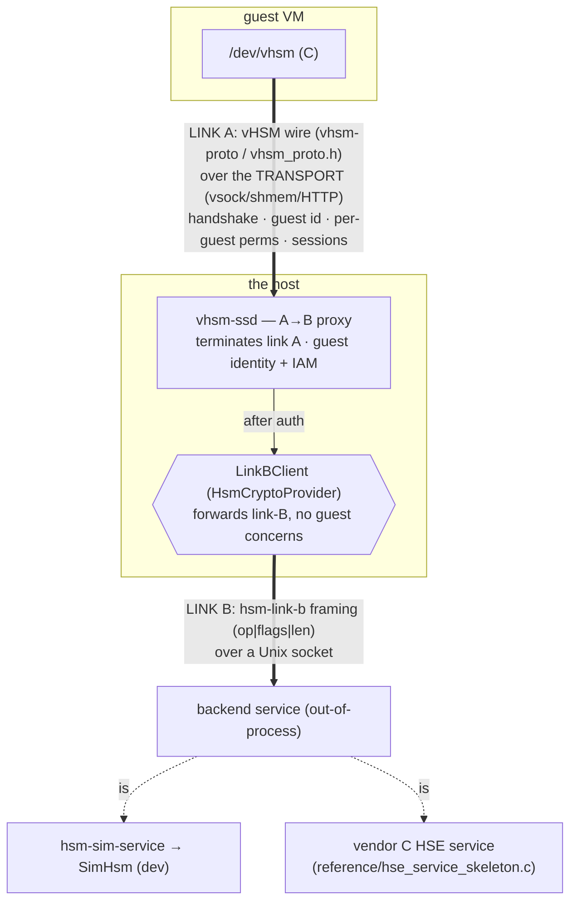

# HSM backend architecture — the three seams, the backends, and the slot map

**Status:** IMPLEMENTED, 2026-06-27. The maximum convergence landed:
`hsm-link-b` (the frozen wire + C header), `hsm::link_b` (`LinkBClient` + `serve_crypto`),
`hsm-sim-service` (the sim as an out-of-process backend), and the `vhsm-ssd` **A→B proxy**.
The in-process Path-1 driver (`hse-s32g3`) is **retired** — a hardware HSM is now an
out-of-process C service.
**Audience:** hardware-HSM implementers — including the C-side HSE author — and reviewers.
**Companions** (alongside): [`hsm-contents.md`](./hsm-contents.md) (the slot *inventory* — what
keys the HSM holds) and [`vhsm-integration-path.md`](./vhsm-integration-path.md) (the end-to-end
guest→host→device path + how to verify a backend); plus `authorization.md` (the link-A guest
auth) in the workspace `docs/design/`. The frozen wire, the C contract, and the vendor skeleton
live in `crates/hsm-link-b` (`src/lib.rs`, `include/hsm_link_b.h`, `reference/`); the
conformance suite is `tools/crates/hsm-conformance`.

## TL;DR

- **Three separate seams — do not conflate them:** the **transport**, **link A**
  (guest↔host, the vHSM wire), and **link B** (host↔backend, the op contract).
- Every backend is an **out-of-process link-B service** — the sim (`hsm-sim-service`) or a
  vendor's C HSE — reached identically over one socket. `vhsm-ssd` can't tell them apart.
- A hardware-HSE vendor implements **link B only** (`hsm-link-b`) — never the transport or
  link A.
- The cross-hardware-stable contract = **link B + the logical handle inventory**. Only the
  **slot map** and the **crypto behind link B** vary per silicon.

## 1. The three seams

### Transport — *how bytes move*
`DeviceTransport` / `vm-wire`: vsock, shmem, or HTTP, config-pluggable. **Ours.** Same on
every platform behind the abstraction. **Never handed to a hardware vendor** (doing so would
freeze it to their choice and break portability).

### Link A — guest-HSM ↔ host-HSM (the vHSM wire)
`vhsm-proto` (sumo-machine-manager) and its C mirror `vhsm_proto.h` (the **guest** side).
Carries the **guest-facing** protocol: the `Hello/Auth/Enroll` handshake, **guest identity**,
**per-guest IAM permissions**, sessions, and the guest-exposed handle subset. Terminated by
`vhsm-ssd`. **Ours, stable, uniform across hardware.**

### Link B — host-HSM ↔ backend service (the op contract)
The `hsm-link-b` crate: the frozen wire (a uniform 3-field LE frame, the per-op payload table,
the `OP_*`/`ST_*`/`KEYTYPE_*` constants, the `KeyInfo` layout) carrying the `HsmCryptoProvider`
op surface — `sign / verify / encrypt / decrypt / mac_* / derive / get_public_key_der /
get_key_info / generate_key / unwrap_cek_* / …`, **all by `KeyHandle`**, plus the provisioning
ops. **No** handshake, **no** guest identity, **no** per-guest perms — the host already
authenticated the guest on link A. **This — and only this — is what a hardware-HSE vendor
implements**, and it is *decoupled* from link A so the two evolve independently.

### `vhsm-ssd` is the A→B proxy
It terminates link A, performs the guest identity + IAM authorization, then forwards each op
over link B — a `LinkBClient` (`hsm::link_b`) to the **spawned backend service**. It holds no
crypto itself; the backend (sim or vendor C) does.

> **The conflation to avoid:** link A has sessions/identity/perms; link B is raw crypto by
> handle. A vendor's HSE service is **link B**; it never sees link A.

## 2. Backends (every one is an out-of-process link-B service)

| Backend | What | Role |
|---|---|---|
| **`hsm-sim-service`** | `SimHsm` (software) served over link-B (`serve_crypto`) | **non-production** dev/test backend + the runnable reference of a *conforming* impl — **just another link-B implementation, not privileged** |
| **vendor C HSE service** | a C process implementing `hsm-link-b` (skeleton: `hsm-link-b/reference/hse_service_skeleton.c`) | the production path, per silicon |

`hsm-sim-service` and a vendor HSE are *peers* behind link B — whoever launches the backend
(the orchestrator in production, vhsm-ssd in dev) selects between them purely by which backend
command runs, and nothing above link B can tell them apart. Both must pass `hsm-conformance` (§6);
the sim does, the *stub* C skeleton does not (its crypto is unimplemented) — which is how the
suite proves it checks crypto, not just framing.

**Production ownership:** the **orchestrator** (e.g. supernova, or `example/run.sh`) spawns
and owns the backend service, and `vhsm-ssd` runs **connect-only** (`--backend-connect-only`
+ `--backend-socket`) against that pre-spawned socket — it never spawns or kills the backend.
As a dev/standalone convenience `vhsm-ssd` can instead spawn the backend itself
(`--backend-cmd`, default the sibling `hsm-sim-service`; `--backend-socket` / default
`<keystore>/hsm-backend.sock`); either way it connects a `LinkBClient`. New silicon = a new C
service implementing the same contract — nothing above link B changes. (The old `QnxHsm` and
in-process `HseHsmProvider`/`hse-s32g3` are retired.)

## 3. One integration path (the ADR, resolved)

The earlier design kept two options open: **in-process** (a Rust MU driver — `hse-s32g3` —
building HSE descriptors itself) vs **out-of-process** (a C service answering link-B over a
socket). **Resolved: out-of-process.** A vendor's HSE SDK is C, and we cannot realistically
reimplement each chip's driver in Rust (the in-process `hse-s32g3` was already a fabricated-
address dead-end). So a hardware HSM is a **C service behind link B**, uniform across silicon;
`hse-s32g3` is retired. See D1/D4.

## 4. The slot map (logical → physical)

- **Logical handles.** `vhsm_proto::SUMO_CORE_SLOTS` binds `handle ↔ key_id ↔ alg` for the
  core roles. Link B addresses keys by **logical handle**; this inventory is hardware-agnostic
  and identical on every device.
- **The map** binds each logical handle → a physical HSE slot **of a matching key type**, or
  marks it **`virtual`** — no private slot (e.g. the public-only trust anchors, verified from
  keystore pubkey bytes).
- **The binding *is* the validation.** An EC role cannot land in an AES slot; an unmappable
  type or an exhausted catalog fails loudly. So *"logical handle `0x0003` (EC) → slot N"* is
  agreed by a table, not hand-waved.
- **Where it lives:** *inside the backend service*, below link B — the per-hardware binding the
  **integrator** owns. The C skeleton's `SLOT_MAP` table
  (`hsm-link-b/reference/hse_service_skeleton.c`) is the worked reference a real integrator
  replaces for their silicon (keep the logical handles, substitute physical slots).

(The slot *inventory* — what each role *is* — lives in [`hsm-contents.md`](hsm-contents.md); this is the
*mapping* onto physical slots.)

## 5. The cross-hardware invariant

| Same on every device / SoC | Varies per hardware |
|---|---|
| the transport abstraction | the physical slot layout (the slot map, in the backend) |
| link A (the vHSM wire) | the crypto behind link B (the backend service impl) |
| link B (`hsm-link-b`) | |
| the logical handle inventory | |

**Porting to new silicon = a new link-B C service + its slot map. Nothing above link B moves.**

## 6. The vendor handoff

Give the C-side HSE author the `hsm-link-b` crate — and *only* link B:
- **`include/hsm_link_b.h`** — the C contract (op/status/keytype constants + the 3-field frame).
- **`src/lib.rs`** — authoritative: the per-op payload table + the field codec (`Writer`/`Reader`).
- **`reference/hse_service_skeleton.c`** + **`reference/README.md`** — a compilable, full-surface
  skeleton (all 25 ops; crypto stubbed at `TODO(vendor)`; a hypothetical slot map to replace).
- **KAT vectors** — known-answer tests run against the real HSE.

**Do not give them** the transport or link A (the guest wire). The runnable software reference
of the same contract is **`hsm-sim-service`** (the sim served over link-B) — the host side can
be exercised against it before any real HSE crypto exists.

## 7. Decisions

- **D1.** A hardware vendor implements **link B only**; the transport and link A stay ours and
  uniform across hardware (never frozen to one vendor). *(saka)*
- **D2.** The cross-hardware-stable contract = **link B + the logical handle inventory**; every
  new HSM implements the same link B.
- **D3.** **sim ∥ hardware** behind one link-B socket — `vhsm-ssd` can't tell the sim
  (`hsm-sim-service`) from a vendor C HSE; no dead-ends, no special-casing.
- **D4. RESOLVED — out-of-process.** Hardware HSMs are C services behind link B, not in-process
  Rust drivers; `hse-s32g3` is retired and `vhsm-ssd` is a pure A→B proxy. *(saka: "retire it",
  "maximum convergence")*
