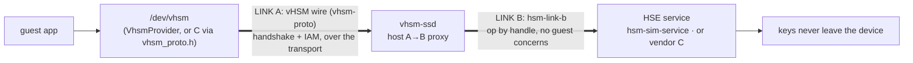

# vHSM integration path — guest → host → device

**Status:** 2026-06-27. The end-to-end path a crypto op travels — guest app to the
device HSM and back — and what an integrator provides at each hop. Companion to
[`hsm-backend-architecture.md`](./hsm-backend-architecture.md) (the seam/contract
design) and `authorization.md` (the link-A guest auth, in the workspace `docs/design/`).

## The path



A crypto op (e.g. `sign`) travels:

1. **Guest app → `/dev/vhsm`.** The app calls a handle-addressed HSM op
   (`sign(handle, data)`). In Rust that's the guest-side `VhsmProvider` (a
   `HsmCryptoProvider` that forwards over the wire); in C the guest speaks
   `vhsm_proto.h` to `/dev/vhsm`. Either way the guest holds **no key material**.
2. **Link A — the vHSM wire.** `vhsm-proto` over the transport (vsock / shmem /
   HTTP). The guest first completes the `Hello/Auth/Enroll` handshake (CWT- or
   IP-based identity); every op is then gated by per-guest **IAM**.
3. **Host → `vhsm-ssd`.** The daemon terminates link A — it authenticates the
   guest and checks IAM — then forwards the bare op downward. It is a pure
   **A→B proxy**: it holds no crypto itself.
4. **Link B — the backend contract.** `hsm-link-b` (the op-by-handle framing) to
   the backend HSM service. **No** guest identity, sessions, or IAM cross link B —
   the host already enforced them.
5. **Device → the HSE service.** The backend — `hsm-sim-service` in dev, a vendor C
   HSE in production — resolves the logical handle to a physical slot and performs
   the crypto. **Keys never leave the device.** The result returns up the same path.

Link A and link B are **decoupled**: the guest wire can evolve without touching any
HSE backend, and an HSE backend can change without touching guests.

## What an integrator provides at each hop

| Hop | Who provides it | What you do |
|---|---|---|
| Guest (`/dev/vhsm`, `VhsmProvider`) | ours | use the handle-addressed HSM API; no crypto in the guest |
| Link A (vHSM wire + transport) | ours | config: the transport + the guest's identity (CWT / IAM) |
| Host (`vhsm-ssd`) | ours | config: the transport + `--backend-cmd` (which backend to spawn) |
| Link B (`hsm-link-b`) | the frozen contract | nothing — it's fixed |
| **Device (HSE service)** | **you (the HSM vendor)** | a C service implementing `hsm-link-b`; verify with `hsm-conformance` |

**Integrating a new HSM = writing exactly one thing: a link-B service for your
silicon.** Everything above link B — the guest API, the transport, the proxy, the
IAM — is ours and does not change per device.

## Verify your backend

```sh
hsm-conformance --backend-cmd ./your-hse-service [--keystore <dir>]
```

`hsm-conformance` drives your service through the link-B contract — keygen, a
**real-crypto KAT** (it signs, then verifies the signature independently with
`p256`), virtual-handle handling, and the error cases — and prints a pass/FAIL
report (`tools/crates/hsm-conformance`). The software reference `hsm-sim-service` passes
it; the **stub** C skeleton does **not** (its crypto is stubbed) — which is exactly
how you know the suite checks *crypto*, not merely framing.

## The three reference points (none is privileged)

- **`hsm-sim-service`** — a complete software backend (`SimHsm` over `serve_crypto`).
  It is **non-production** — dev/test only — and is *just another link-B
  implementation*, the runnable reference of a *conforming* one. The host treats it
  identically to a vendor HSE (it's selected by `--backend-cmd`, not special-cased).
- **`hsm-link-b/reference/hse_service_skeleton.c`** — the C skeleton you start from
  (the framing + slot map are done; fill the `TODO(vendor)` crypto, replace the
  `SLOT_MAP`).
- **`hsm-conformance`** — the suite your service must pass.
